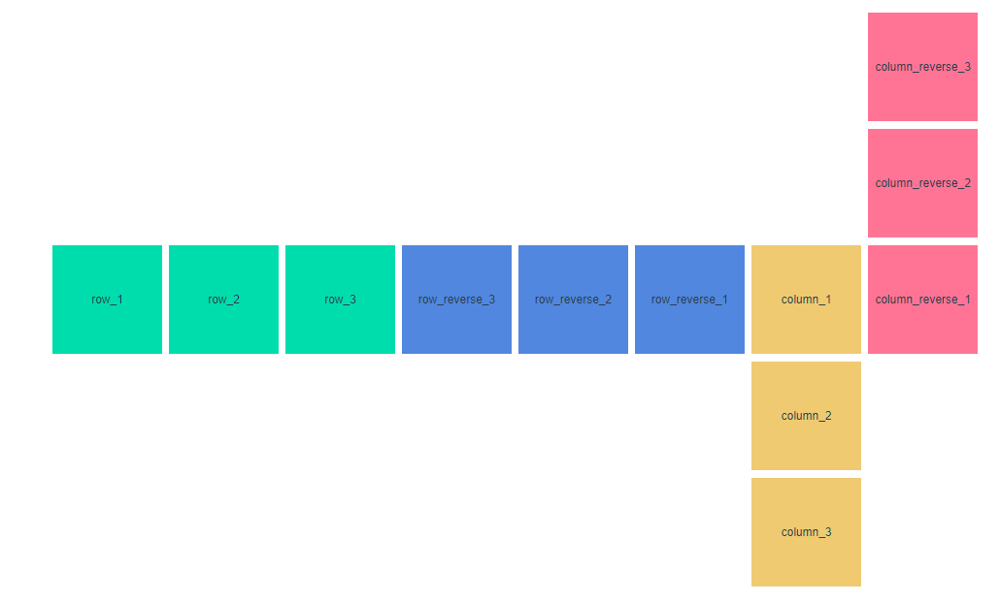
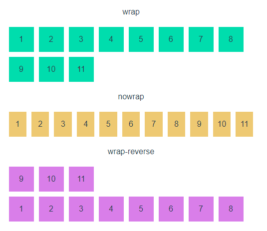
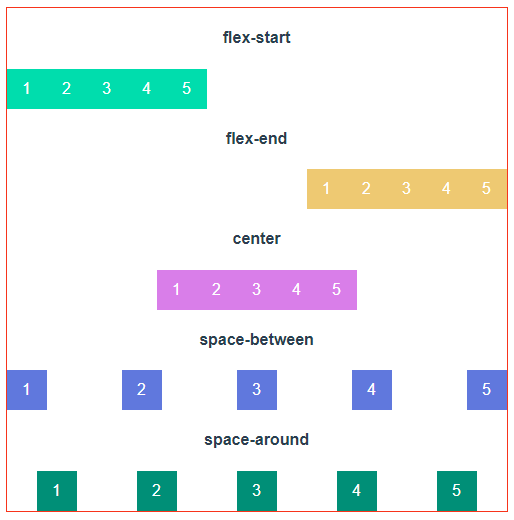

### Flex--弹性布局
***  
:warning:：设为弹性布之后，子元素的 `float`,`clear`,`vertical-align` 将失效   
1. #### 用法  
    父元素 `display:flex` 或 `display:inline-flex` (行内弹性布局）   
2. #### 容器属性 
    - **flex-direction**:point_right:定义项目的排列方式      
        `flex-direction:row|row-reverse|column|column-reverse`   
        - **row（默认值）**：主轴为水平方向，起点在左端  
        - **row-reverse**：主轴为水平方向，起点在右端  
        - **column**：主轴为垂直方向，起点在上沿   
        - **column-reverse**：主轴为垂直方向，起点在下沿    
        
    - **flex-wrap**:point_right:定义如果一条轴线排不下，如何换行。  
        `flex-wrap:wrap|nowrap|wrap-reverse`  
        - **wrap**：换行，第一行在上方  
        - **nowrap（默认值）**：不换行  
        - **wrap-reverse**：换行，第一行在下方  
        
    - **flex-flow**:point_right:属性是**flex-direction**属性和**flex-wrap**属性的简写形式，默认值为row nowrap.  
    - **justify-content**:point_right:属性定义了项目在主轴（水平方向）上的对齐方式。  
        `justifly-content:flex-start|flex-end|center|space-between|space-around`  
        - **flex-start**：左边开始对齐  
        - **flex-end**: 右边开始对齐  
        - **center**: 居中对齐  
        - **space-between**：两端边沿对齐，项目之间的间隔都相等  
        - **space-around**：两端对齐，每个项目两侧的间隔相等。所以，项目之间的间隔比项目与边框的间隔大一倍。  
          
    - **align-items**:point-right:属性定义项目在交叉轴（垂直方向）上的对齐方式  
        `align-items:flex-start|flex-end|center|baseline|stretch`  
        - **flex-start**：顶部对齐  
        - **flex-end**：底部对齐  
        - **center**：居中对齐 
        - **baseline**： 第一行文字的基线对齐 
        - **stretch**（默认值）： 如果项目未设置高度或设为auto，将占满整个容器的高度。   

