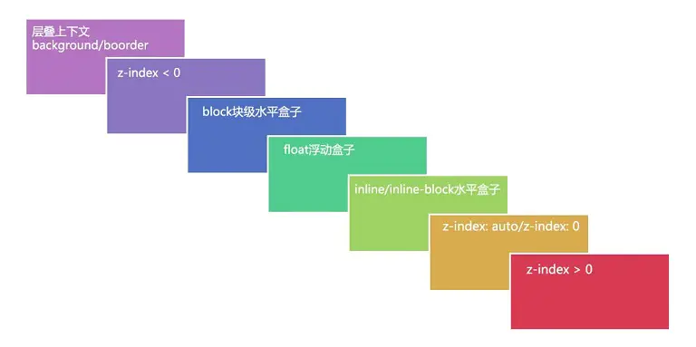

**z-index** 是CSS的属性，用于定义一个元素在屏幕Z轴上的层叠顺序。仅在定位元素(非static)上有效。    
但是一个元素的层叠顺序不仅仅是由`z-index`的数值决定，还由**层叠上下文**、**层叠等级**共同决定。  

**层叠上下文：** 可以理解为比普通元素在Z轴上更高一层的元素。  
**层叠等级：**
- 在普通元素中，表示在Z轴上的上下顺序
- 同一个层叠上下文中，表示该层叠上下文中的层叠上下文元素在Z轴上的上下顺序。  
第二点是不是有点绕，那来看看一个例子：  
>A班有班长A1,副班长A2。(同一层叠上下文)   
B班有班长B2,副班长B2。(同一层叠上下文)   
在A班中，A1职位是大于A2的(同理B班)，A2和B2虽然都是副班长，但不在一个班就没有比较的意义。  

所以在不同层叠上下文中比较层叠等级是没有意义的。

**层叠顺序**：是指在不考虑CSS3的情况下，元素层叠的规则。

**比较规则**：
- 如果不在同一层叠上下文，先比较他们所在的层叠上下文的层叠顺序
- 如果在同一层叠上下文，z-index的等级越大的在最上面
- 如果在同一层的上下午，z-index的等级相同，在DOM结构中后面的元素会覆盖之前的元素

**如何产生层叠上下文**
- HTML根元素就是一个根层叠上下文
- 普通元素设置position(非static)并设置z-index，会产生层叠上下文

每一次改变z-index都会引起重绘和回流，所以还是尽量少用比较好。