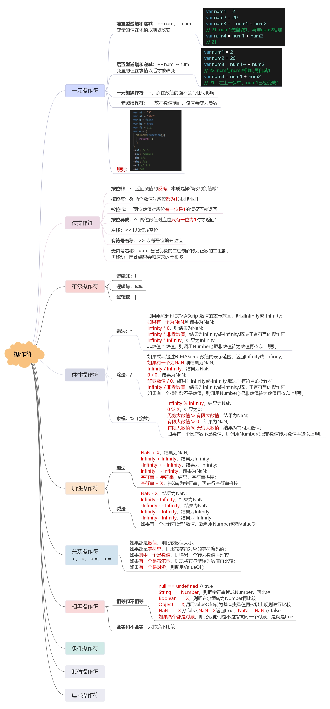

**类型转换**：在JavaScript中，类型转换有三种：  转换为`布尔值`、`数字`、`字符串`  

原始值|转换目标|结果
:--:|:--:|:--:
String|Boolean|空串为：false</br>非空串为：true
Number|Boolean|除了0、-0、NaN都为true
null/undefined|Boolean|false
引用类型|Boolean|true
--|--|--
String|数字|'1'=>1</br>'1a'=>NaN
Boolean|数字|true为 1</br>false 为0
Null|数字|0
数组|数字|空数组为0</br>存在一个元素且为数字则转数组</br>其他为NaN
除了数组外的其他引用类型|数字|NaN
Symbol|数字|抛错
--|--|--
number|字符串|5=>'5'
boolean|字符串|true=>'true'
数组|字符串|[1,2]=>'1,2'
对象|字符串|'[Object Object]'

**四则运算**
```js
1 + '1' // '11'
true + true //2
4 + [1,2,3] // [41,2,3]
a + + b // NaN
4 * '3' // 12
4 * [1,2]// NaN
var a = 1
```


**关系操作符**：`>`、`<` 、 `>=` 、`<=`  
- 如果两个都是数字，则比较数值大小
- 如果两个都是字符串，则比较两个字符串对应的字符编码值
- 如果一个操作数是数值，则将另一个转为数值再比较
- 如果一个操作符是对象，则调用valueOf()或者toString()方法，再按以上规则进行比较
- 如果一个操作数是布尔值，则先将其转换为数值，再执行比较



### JS的 == 和 === 有什么区别？
**==** 是指两边是否等同，内部有个强制转型，如果两边类型不相同则会先转换成同一类型再比较  

**转换规则**  
- 如果类型相等，则比较值是否相等
- 判断是不是null和undefined在对比，是的话返回true
- 如果其中一方是String，另一个是Number，则把字符串换成Number，再比较
- 如果其中一方为Boolean,则把布尔型转为Number再比较
- 如果其中一方为Object,另一方不是，就把Object调用valueOf()转为基本类型值再按以上规则进行比较
- 如果有一个为NaN，则==返回false,!=返回true，但NaN==NaN返回false
- 如果两个都是对象，则比较他们是不是指向同一个对象，是就是true
```js
[] == ![] //true
//首先布尔操作符!优先级更高，所以被转变为：[] == false,
//操作数存在布尔值，转为数字：[] == 0
//操作数[]为对象，转为原始类型转为空字符串，0 == 0
5 == NaN //false
NaN == NaN //false,NaN不等于任何值
NaN != NaN //true
null == undefined //true
null == 0 //false
undefined == 0 //false
```

**===** 是指两边是否全等，类型和值都要相等  

