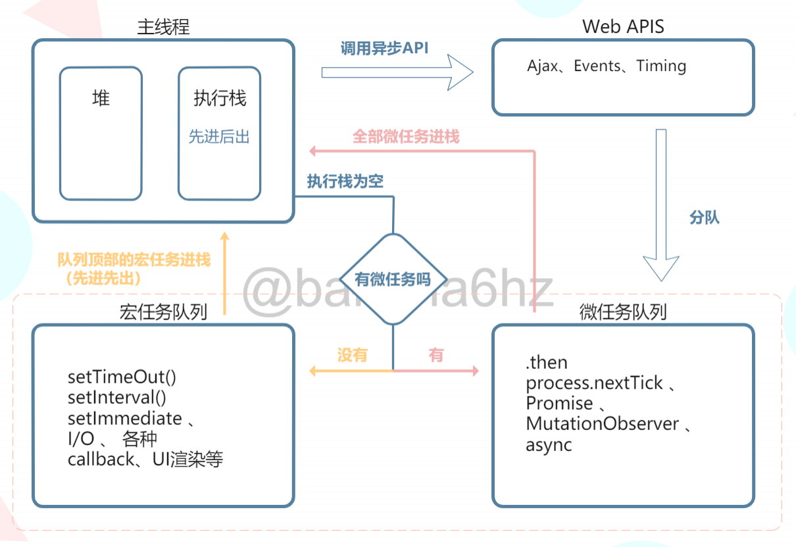

哎一古，这个问题是面试的常客啊！让我来好好学习一下吧！！  
### 为什么JavaScript是单线程？
单线程的意思就是说：一次只能干一件事儿。  

那为什么要有这么没有效率的机制呢？来举个栗子🌰：
如果不是单线程，那就可以一下干好多事儿啦。一个线程当我们在给某个DOM节点增加内容的时候，另一个线程正在删除这个DOM节点的内容，那要听谁的呢？这就乱套了！所以还是老老实实单线程，一件一件的完成。(虽然javascript是单线程，但是javascript中有同步和异步的概念，解决了js阻塞的问题。)

### 同步和异步  
**同步**：同步就是说，如果在一个函数返回的时候，调用者就能够即时得到预期结果  
**异步**：异步就是说，如果在函数返回的时候，调用者还不能够得到预期结果，而是需要在将来通过一定的手段得到，像`setTimeout()`就是一个异步函数  

JavaScript里面有两种任务：  
**同步任务**：在<u>主线程</u>(执行栈)排队执行的任务，只有前一个执行完毕，才能执行下一个任务  
**异步任务**：在<u>任务队列</u>(先入先出),只有任务队列通知主线程，可以执行某个异步任务的时候，该任务才会进入主线程。 "任务队列"是一个先进先出的数据结构，排在前面的事件，优先被主线程读取。任务队列又分为宏任务和微任务
- 宏任务：setTimeOut、setInterval、setImmediate、I/O、各种callback、UI渲染等
- 微任务：then、process.nextTick 、Promise 、MutationObserver 、async(实质上也是promise)


### 事件循环  
线程从"任务队列"中读取事件，这个过程是循环不断的，所以整个的这种运行机制又称为Event Loop（事件循环）  

为了能更好地理解这个事件循环，自己做了个图💡


<i>PS:设计好难，找了半天配色还是好丑😭</i>

**执行流程**  
:one: JavaScript内核加载代码到<font color="#f34134">执行栈</font>。  
:two: 执行栈依次执行<font color="#f34134">同步任务</font>，发现调用异步API则会添加回调事件到回调(任务)队列中。  
:three: <font color="#f34134">宏任务</font>进入宏任务队列，<font color="#f34134">微任务</font>进入微任务队列。  
:four: 栈内代码执行完毕，查看微任务队列是否为空，若不为空，微任务队列中的<font color="#f34134">所有微任务</font>进入执行栈执行（相当于清空队列）。  
:five: 执行栈执行完微任务，此时微任务队列为空，宏任务队列<font color="#f34134">第一条宏任务</font>(先进先出原则哦)进入执行栈。  
:six: 执行<font color="#f34134">宏任务</font>，若此过程总又再遇到微任务或者宏任务,则执行:three:。  

由此可见，这样的执行流程就构成了一个事件的循环检测机制，即我们所称的eventloop。  
<i>PS:宏任务总会在下一个EventLoop中执行。</i>

✨先来一道题看看是不是真的理解好了：  
```js
console.log(1);
setTimeout(function() {
    console.log(2);
}, 0);
new Promise(function(resolve) {
    console.log(3);
    resolve(Date.now());
}).then(function() {
    console.log(4);
});
console.log(5);
setTimeout(function() {
    new Promise(function(resolve) {
        console.log(6);
        resolve(Date.now());
    }).then(function() {
        console.log(7);
    });
}, 0);
//来猜猜执行结果🤠
```

<details><summary><b>Answer</b></summary>
<p>
1. 执行 <code>console.log(1);</code> <u>输出1</u>。</br>
2. 遇到 <code>第一个setTimeout()</code> push到宏任务队列。</br>
3. 执行 <code>console.log(3)</code> <u>输出3</u>;遇到 <code>.then()</code> ,push到微任务队列。</br>
4. 执行 <code>console.log(5)</code> <u>输出5</u></br>
5. 遇到 <code>第二个setTimeout()</code> push到宏任务队列。</br>
6. 同步任务代码执行完毕，执行栈为空。读取微任务队列。执行 <code>.then()</code> <u>输出4</u></br>
7. 执行栈为空，微任务队列为空，宏任务队列顶部宏任务进栈。执行 <code>第一个setTimeout()</code> <u>输出2</u></br>
8. 执行栈为空，微任务队列为空，执行下一个宏任务 <code>第二个setTimeout()</code> <u>输出6</u>, 遇到 <code>.then()</code> push到微任务队列。</br>
9. 执行栈为空，微任务队列不为空，执行微任务 <code>.then()</code> <u>输出7</u></br>
💡 因此，最终的输出顺序为：1, 3, 5, 4, 2, 6, 7;
</p>
</details>

### 题解  
Q: 我的setTimeout函数到时间了，为啥一直不去执行。

A: setTimeOut的回调会被放到任务队列中，需要当前的执行栈执行完了，才会去执行执行任务队列中的内容。出现setTimeout回调不及时，说明在执行栈中出现了阻塞，或者说执行代码过多。

Q: 微任务有两种 nextTick 和 then 那么这两个谁快呢？

A: nextTick快。

