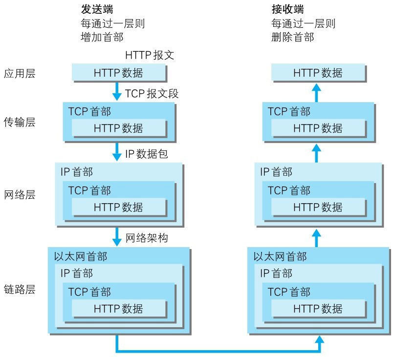

## TCP/IP协议 

TCP/IP 是用于因特网 (Internet) 的通信协议。HTTP协议是它的一个子集。TCP/IP协议族按层次分为以下四层。（用书网恋）😂？？
- 应用层  
规定了向用户提供应用服务时通信的协议
- 传输层  
传输层对接上层应用层，提供处于网络连接中两台计算机之间的数据传输所使用的协议  
在传输层有两个性质不同的协议：TCP（Transmission Control Protocol，传输控制协议）和UDP（User Data Protocol，用户数据报协议）。
   - TCP协议是全双工的，即发送数据和接收数据是同步进行的，就好像我们打电话一样，说话的同时也能听见。TCP协议在建立和断开连接时有三次握手和四次挥手，因此在传输的过程中更稳定可靠但同时就没UDP那么高效了
   - UDP协议是面向无连接的，也就是说在正式传递数据之前不需要先建立连接。UDP 协议不保证有序且不丢失的传递到对端，也就是说不够稳定，但也正因如此，UDP协议比TCP更加高效和轻便。
- 网络层  
网络层规定了数据通过怎样的传输路线到达对方计算机传送给对方(IP协议)  
就跟携程提供的回家路线图作用一样。
- 链路层  
用来处理连接网络的硬件部分，包括控制操作系统、硬件的设备驱动、NIC（Network Interface Card，网络适配器，即网卡），及光纤等物理可见部分（还包括连接器等一切传输媒介）。硬件上的范畴均在链路层的作用范围之内。

利用TCP/IP协议族进行网络通信时，会通过分层顺序与对方进行通信。发送端从应用层往下走，接收端则往应用层往上走。  
接收端的服务器在链路层接收到数据，按序往上层发送，一直到应用层。当传输到应用层，才能算真正接收到由客户端发送过来的HTTP请求。  

## TCP和UDP的区别？  
TCP是面向连接、可靠的、基于字节流的传输层协议。  
UDP是面向无连接的传输层协议。
- **面向连接**：所谓连接，指的是客户端和服务器的连接。在双方互相通信之前，TCP需要三次握手建立连接，而UDP没有这一过程。
- **可靠性**：TCP的可靠性体现在有状态和可控制。
   - 有状态：TCP会精准记录哪些数据发送了，哪些数据被对方接受了，哪些没收到，并且保证数据包按序到达。
   - 可控制：当意识到丢包或者网络环境不佳，TCP会根据具体情况调整自己的行为，控制自己的发送速度或者重发。
- **面向字节流**：UDP的传输数据是基于数据报的，这是因为仅仅只是继承了IP层的特性，而TCP为了维护状态，将一个个IP包变成字节流。

## TCP的三次握手
:one: :客户端发送SYN包到服务器，并进入到发送状态(SYN_SENT)  
:two: :服务器收到并确认客户端的SYN，同时发送一个SYN+ACK包给客户端，服务器进入接受状态(SYN_RECV)   
:three: :客户端接收到服务器的SYN+ACK包，并向服务器发送确认包ACK，此包发送完毕，客户端和服务器的TCP连接成功。  

简易版：  
C：S大哥，我家做了红烧肉想给你尝尝。(C进入发送状态)  
S：C小弟，好啊我在家，你拿过来吧。(S进入接受状态)  
C：好咧S大哥，我这就来。(C得知S已进入接受状态，连接成功)

## TCP的四次挥手
:one: :Client发送一个FIN，关闭Client到Server的数据传送，Client进入FIN_WAIT_1状态(Client还能接收)。  
:two: :服务器接收到连接释放报文，发出确认报文。Server进入CLOSE_WAIT状态。(Server继续发送没发完的数据包)  
:three: :Server发完数据包之后，服务器发送一个FIN,关闭Server到Client的数据传送，Server进入LAST_ACK状态。  
:four: Client收到FIN后，发送ACK给Server，Client进入CLOSE状态。Server接收到ACK后进入CLOSED状态。

简易版   
C：S大哥，我家红烧肉没了就不给你送了。(C停止发送，但还可以接受)  
S：C小弟，好的我知道你没红烧肉了，但是我家还有炸鸡，再给你带点。(S确认，但继续发送)  
S：C小弟，我家炸鸡也没了。(S停止发送)   
C；S大哥，我知道了,拜拜。(C停止接收，进入CLOSE)。S听到拜拜之后，也进入CLOSE。