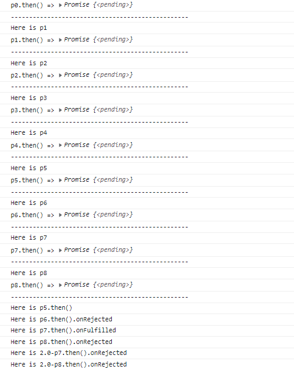

## Promise

- 理解 promise 基础概念
- 理解 promise 常用 api
- 手写 promise

### 理解 Promise

#### 含义

<font style="color:#ff502c; background-color: #fff5f5;">Promise</font> 是一个<b>异步编程</b>的解决方案，比传统的异步解决方案: <b>回调函数</b>和<b>事件</b>更合理、更强大。  
`async` 和 `await` 的底层都是使用了 `promise`

<font style="color:#ff502c; background-color: #fff5f5;">Promise</font> 对象代表一个异步操作，它有三种状态：

- <b>pending</b>（进行中）: 初始状态或者处理中
- <b>fulfilled</b>（已成功）：表示成功完成
- <b>rejected</b>（已失败）：表示失败

为了更好的理解`promise`的运行过程，看看下面一段代码，并思考下它们都会输出什么

```js
const p0 = new Promise();
const p1 = new Promise(() => {});
const p2 = new Promise((resolve, reject) => {
  resolve("成功");
});
const p3 = new Promise((resolve, reject) => {
  reject("失败");
});
const p4 = new Promise((resolve, reject) => {
  resolve("成功");
  reject("失败");
});
const p5 = new Promise((resolve, reject) => {
  reject("失败");
  resolve("成功");
});
const p6 = new Promise((resolve, reject) => {
  throw "error";
});
console.log("p0=> ", p0);
console.log("p1=> ", p1);
console.log("p2=> ", p2);
console.log("p3=> ", p3);
console.log("p4=> ", p4);
console.log("p5=> ", p5);
console.log("p6=> ", p6);
```

<details><summary><b>点击查看结果</b></summary>


</details>

可以得出：

- `promise`必须给`Promise`对象传入一个执行函数，否则将会报错
- `promise`的初始状态为 <b>pending</b>, 如果没有处理则一直为`pending`
- 执行 <b>resolve</b> 之后，`promise`的状态会变成 <b>fulfilled</b>
- 执行 <b>reject</b> 之后，`promise`的状态会变成 <b>reject</b>
- `promise`的状态改变有两种情况 <b>pending => resolve</b> 和 <b>pending => reject</b>，并且他以第一次改变的结果为准，一旦改变就<b>永久不变</b>
- `promise`中有 <b>throw</b> 的话，相当于执行了 <b>reject</b>

再来看看`promise.then()`是什么

```js
const p0 = new Promise(() => {});
console.log("p0.then() =>", p0.then());
console.log("-------------------------------------------------");

const p1 = new Promise((resolve, reject) => {
  console.log("Here is p1");
});
console.log("p1.then() =>", p1.then());
console.log("-------------------------------------------------");

const p2 = new Promise((resolve, reject) => {
  console.log("Here is p2");
  resolve("成功");
});
console.log("p2.then() =>", p2.then());
console.log("-------------------------------------------------");

const p3 = new Promise((resolve, reject) => {
  console.log("Here is p3");
  reject("失败");
});
console.log("p3.then() =>", p3.then());
console.log("-------------------------------------------------");

const p4 = new Promise((resolve, reject) => {
  console.log("Here is p4");
});
p4.then(() => {
  console.log("Here is p4.then()");
});
console.log("p4.then() =>", p4.then());
console.log("-------------------------------------------------");

const p5 = new Promise((resolve, reject) => {
  console.log("Here is p5");
  resolve("成功");
});
p5.then(() => {
  console.log("Here is p5.then()");
});
console.log("p5.then() =>", p5.then());
console.log("-------------------------------------------------");

const p6 = new Promise((resolve, reject) => {
  console.log("Here is p6");
  reject("失败");
});
p6.then(
  () => {
    console.log("Here is p6.then().onFulfilled");
  },
  () => {
    console.log("Here is p6.then().onRejected");
  }
);
console.log("p6.then() =>", p6.then());
console.log("-------------------------------------------------");

const p7 = new Promise((resolve, reject) => {
  console.log("Here is p7");
  resolve("成功");
});
p7.then(
  () => {
    console.log("Here is p7.then().onFulfilled");
    throw "error";
  },
  () => {
    console.log("Here is p7.then().onRejected");
  }
).then(
  () => {
    console.log("Here is 2.0-p7.then().onFulfilled");
  },
  () => {
    console.log("Here is 2.0-p7.then().onRejected");
  }
);
console.log("p7.then() =>", p7.then());
console.log("-------------------------------------------------");

const p8 = new Promise((resolve, reject) => {
  console.log("Here is p8");
  reject("失败");
});
p8.then(
  () => {
    console.log("Here is p8.then().onFulfilled");
  },
  () => {
    console.log("Here is p8.then().onRejected");
    throw "error";
  }
).then(
  () => {
    console.log("Here is 2.0-p8.then().onFulfilled");
  },
  () => {
    console.log("Here is 2.0-p8.then().onRejected");
  }
);
console.log("p8.then() =>", p8.then());
console.log("-------------------------------------------------");
```

<details><summary><b>点击查看结果</b></summary>



</details>

可以得出：

- 不管是否执行`resolve`和`reject`，都能打印出`promise.then()`，返回一个新的 Promise 实例（注意，不是原来那个 Promise 实例）
- 因为`promise.then()`返回的也是一个`promise`对象，所以可以添加多个`then()`链试调用，他们按添加顺序执行
- `promise.then()`就是一个回调函数，用户可以自定义函数内容, 它可以传入两个参数，分别指定`resolved`状态和`rejected`状态的回调函数，即让它成功之后做什么失败之后做什么
- `pending`状态下的`promise`不会执行回调函数`then()`，只有变为`resolved`和`reject`状态之后，通过`then()` 添加的回调函数才会被调用

### 基本用法

Promise 对象本身就是一个构造函数，可以直接用来生成 promise 实例

```js
const promise =  new Promise((resolve, reject) => {
  if (/* 异步操作成功 */) {
    resolve()
  } else {
    reject()
  }
})
```

- Promise 构造函数接受一个函数作为参数，该函数有两个参数：resolve、reject
- resolve：将 pending 转为 fulfilled, 在异步操作成功时调用
- reject：将 pending 转为 rejected, 在异步操作失败时调用

```js
promise.then(
  () => {
    // handle resolved
  },
  () => {
    // handle rejected
  }
);
```

- Promise 实例生成以后，then 方法可以接受两个回调函数作为参数，可以用于分别指定异步操作成功和失败的回调函数
- 这两个函数都是可选的，不一定要提供

resolve 函数的参数除了正常的值以外，还可能是另一个 Promise 实例，比如像下面这样

```js
const p1 = new Promise((resolve, reject) => {});
const p2 = new Promise((resolve, reject) => {
  resolve(p1);
});
```

- p1、p2 都是 promise 的实例,p1 作为 p2 resolve 的参数，即一个异步操作的结果(p2)是返回另一个异步操作(p1)
- 只有 p1 状态改变了,p2 的 resolve 才会执行，如果 p1 的状态是 pending，那么 p2 的回调函数就会等待 p1 的状态改变

调用 resolve 或 reject 并不会终结 Promise 的参数函数的执行

```js
const promise = new Promise((resolve, reject) => {
  resolve(1);
  console.log(2);
}).then((r) => {
  console.log(r);
});
```

- 执行完`resolve(1)`之后，还是会执行`console.log(2)`,并且会首先打印出来

### Promise.prototype.then()

- `then`方法是定义在原型对象 `Promise.prototype` 上面的方法
- `then` 方法的第一个参数是 `resolved` 状态的回调函数，第二个参数是 `rejected` 状态的回调函数，它们都是可选的
- `then` 方法返回的是一个<b>新的</b> `Promise` 实例（注意，不是原来那个 `Promise` 实例），因此可以采用<b>链式写法</b>，即 `then` 方法后面再调用另一个 `then` 方法
- 采用链式的 `then`，可以指定一组按照次序调用的回调函数。这时，前一个回调函数，有可能返回的还是一个 `Promise` 对象（即有异步操作），这时后一个回调函数，就会等待该 `Promise` 对象的状态发生变化，才会被调用

### Promise.prototype.catch()

- 是`.then(undefined, reject)`或`.then(null, reject)`的别名，用于指定发生错误时的回调函数
- 当`promise`状态变为`reject`，就会调用`catch`指定的回调函数
- 在`then`方法指定的回调函数中，如果运行中抛出错误，也会被`catch`方法捕获
- `reject()`方法的作用，等同于抛出错误
- 如果`Promise`状态已经变成`resolved`，再抛出错误是无效,因为`promise`的状态一旦改变了就不会再变了

```js
const promise = new Promise(function (resolve, reject) {
  resolve("ok");
  throw new Error("test");
  // 在resolve语句后面，再抛出错误，不会被捕获
});
promise
  .then(function (value) {
    console.log(value);
  })
  .catch(function (error) {
    console.log(error);
  });
```

- `Promise` 对象的错误具有<b>冒泡</b>性质，会一直向后传递，直到被捕获为止

```js
getJSON("/post/1.json")
  .then(function (post) {
    return getJSON(post.commentURL);
  })
  .then(function (comments) {
    // some code
  })
  .catch(function (error) {
    // 处理前面三个Promise产生的错误
  });
// 一共有三个 Promise 对象：一个由getJSON()产生，两个由then()产生
// 它们之中任何一个抛出的错误，都会被最后一个catch()捕获
```

- 一般来说，不要在`then()`方法里面定义 `Reject` 状态的回调函数（即 then 的第二个参数），总是使用`catch`方法。

```js
// bad
promise.then(
  function (data) {
    // success
  },
  function (err) {
    // error
  }
);

// good
promise
  .then(function (data) {
    //cb
    // success
  })
  .catch(function (err) {
    // error
    // 可以捕获前面then方法执行中的错误，也更接近同步的写法（try/catch）
  });
```

- 跟传统的`try/catch`代码块不同的是，如果没有使用`catch()`方法指定错误处理的回调函数，`Promise` 对象抛出的错误不会传递到外层代码，即不会有任何反应。通俗的说法就是“Promise 会吃掉错误”
- catch()方法返回的还是一个 Promise 对象，因此后面还可以接着调用 then()方法。如果没有报错，则会跳过 catch()方法。

### Promise.prototype.finally()

- 用于指定不管 `Promise` 对象最后状态如何，都会执行的操作
- `finally`方法的回调函数不接受任何参数，这意味着没有办法知道，前面的 `Promise` 状态到底是 `fulfilled` 还是 `rejected`
- `finally`本质上是`then`方法的特例

```js
promise.finally(() => {});
// 等价于
promise.then(
  (result) => {
    return result;
  },
  (error) => {
    throw error;
  }
);
```

- `finally` 方法总是会返回原来的值

```js
// resolve 的值是 undefined
Promise.resolve(2).then(
  () => {},
  () => {}
);

// resolve 的值是 2
Promise.resolve(2).finally(() => {});

// reject 的值是 undefined
Promise.reject(3).then(
  () => {},
  () => {}
);

// reject 的值是 3
Promise.reject(3).finally(() => {});
```

### Promise.all()

- `Promise.all()`方法用于将多个 `Promise` 实例，包装成一个新的 `Promise` 实例
- `Promise.all()`方法接受一个数组作为参数, 也可以不是数组，但必须具有 Iterator 接口，且返回的每个成员都是 Promise 实例。

```js
const p = Promise.all([p1, p2, p3]);
```

- 只有 p1、p2、p3 的状态都变成 fulfilled，p 的状态才会变成 fulfilled，此时 p1、p2、p3 的返回值组成一个数组，传递给 p 的回调函数。
- 只要 p1、p2、p3 之中有一个被 rejected，p 的状态就变成 rejected，此时第一个被 reject 的实例的返回值，会传递给 p 的回调函数。
