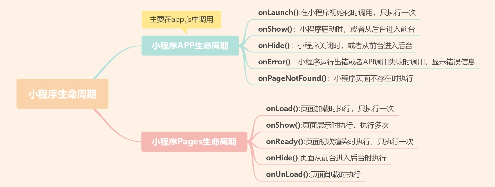
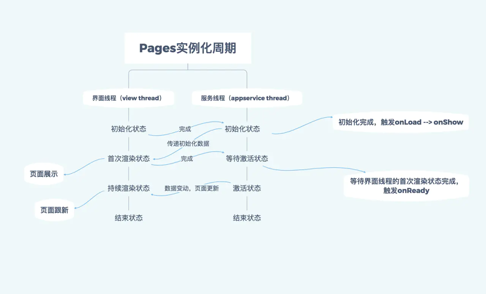

## ✨小程序的一生啊  
**打开小程序**:   
<u>OnLaunch()</u> => <u>OnShow()</u> => onLoad() => onShow() => onReady()  

**切换页面**：   
OnHide()<font color="#425fe">(cur)</font> => onLoad()<font color="#425fe">(next)</font> => onShow()<font color="#425fe">(next)</font> => OnReady()<font color="#425fe">(next)</font> 

**返回上一个页面**：  
onUnload()<font color="#425fe">(cur)</font> => onShow()<font color="#425fe">(pre)</font>  

**退出小程序**：  
<u>onHide()</u>   

**再次进入**：
- App未销毁：热启动
- App已销毁：冷启动   


那什么是热启动和冷启动呢：  
**热启动**：指的是小程序启动成功后，你点了左上角的x或者按了home键离开小程序，小程序并没有直接被销毁，而是进入了后台运行机制中，当你在一定时间内再次打开该小程序时，小程序这时候从后台又重新进入前台，重新渲染页面，这个过程就是热启动。  
**冷启动**：指的是小程序初次加载（从未打开），或者当你卸载小程序,或者被微信自动销毁的时候，当你再次进入重新加载小程序时，这个过程就是冷启动

注意点：小程序只有在冷启动的时候，才会触发onLaunch生命周期

## ✨Page的生命周期  


## ✨小程序路由方式  
**打开新页面**：`wx.navigateTo` 或 `< navigator open-type="navigateTo"/>`  

**Tab切换**：`wx.switchTab` 或 `<navigator open-type="switchTab"/>`  

**页面返回**:  `navigateBack` 或 `<navigator open-type="navigateBack">` 或用户按左上角返回按钮  

**重启动**: `wx.reLaunch` 或  `<navigator open-type="reLaunch"/> ` 

## 小程序下拉更新怎么实现  
- 在json文件添加以下代码
```js
{
    "enablePullDownRefresh": true;

}
```
- 在需要实现下拉更新的页面中写入函数
```js
onPullDownRefresh:function(){
    wx.showNavigationBarLoading() //在标题栏中显示加载
    //模拟加载
    setTimeout(function()
      {
        // complete
        wx.hideNavigationBarLoading() //完成停止加载
        wx.stopPullDownRefresh() //停止下拉刷新
        },1500);
    },
```

## 微信小程序如何授权登录？
```js
 onLoad: function(options) {
    var that = this;
    wx.login({
        success(res){
        console.log(res.code)
        }
    }),
    //查看是否授权
    wx.getSetting({
      success: function(res) {
        if (res.authSetting['scope.userInfo']) {
          console.log("用户授权了");
        } else {
          //用户没有授权
          console.log("用户没有授权");
        }
      }
    }
```

授权登陆之后会有一个 `code`,把这个`code` 发给后台，就会返回一个用户的身份证 `openid`,用于唯一标示不同的用户。

## openid,appid,unionid分别是什么？
- appid: 小程序的唯一凭证，即 AppID，每个小程序都有自己的一个appid
- openid: 用户在同一小程序的唯一标示，同一用户在不同小程序的openid是不一样的。由后台生成。
- unionid: 用户在同一个微信开放平台下的移动应用的唯一标示。如果开发者拥有同一个微信开放平台帐号的多个移动应用、网站应用、和公众帐号（包括小程序），可通过 UnionID 来区分用户的唯一性。对于拥有多个账号的企业来说，unionid可以帮助识别不同公众账号下的用户是否是同一个人。还可以去除重复关注的用户数，便于统计真实的关注用户总数。


## 小程序登陆流程
- `wx.login` 返回一个code
-  以 `code` 为参数发送请求给后台，然后后台返回 `openid`(唯一识别用户)
- 有了这个`openid`,就能知道是哪个用户，以及用这个去获取用户的个人信息

## 如何获取微信用户手机号
- 授权获取用户手机号，并用bindgetphonenumber()回调获取到微信服务器返回的加密数据
```js
<button open-type="getPhoneNumber" bindgetphonenumber="getPhoneNumber">
getPhoneNumber (e) {
    console.log(e.detail.errMsg)
    console.log(e.detail.iv)
    console.log(e.detail.encryptedData)
  }
```
- 前端将 wx.login传回来的code 和 bindgetphonenumber传回来的iv, encryptedData,传给后台解析


