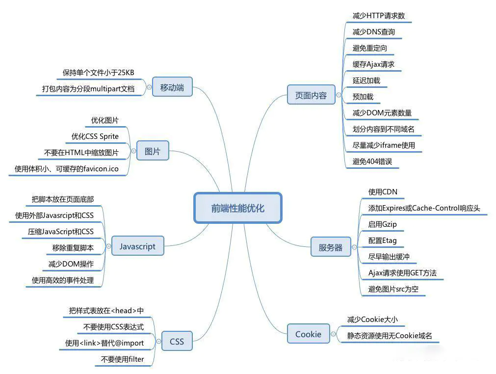

# 计算机网络
## 前端性能优化
了解如何优化前端的性能，可以尽可能地减少页面加载的时间，为用户提供更好的用户体验。下面来学习一下可以从哪些方面入手吧！  
借用一下网上的一张图  
  

一、页面内容  
1. 减少HTTP请求数
- 使用CSS精灵图
- JS/CSS压缩和模块打包
- 行内图片（Base64编码）  
2. 减少DNS查询次数
- 一个网站里面使用至少2个域，但不多于4个域来提供资源
3. 延迟加载  
- 图片懒加载

## 浏览器跨域解决方案  
### 什么是跨域  
当一个请求url的：**协议**、**域名**、**端口**三者之间任意一个与当前地址不同的时候，就是跨域
URL (http://www.a.com/a.html)             |        说明    |   是否允许通信  
:--:|:--:|:--:
http://www.a.com/b.js        | 同一域名下         | 允许 
http://www.a.com/script/b.js |同一域名下不同文件夹 |允许
http://www.a.com:8000/b.js   |同一域名，不同端口   | 不允许
https://www.a.com/b.js       |同一域名，不同协议   |不允许
http://70.32.92.74/b.js      |域名和域名对应ip     |不允许
http://script.a.com/b.js     |主域相同，子域不同   |不允许（cookie这种情况下也不允许访问）
http://a.com/b.js            |同一域名，不同二级域名（同上） |不允许（cookie这种情况下也不允许访问）
http://www.a.com/b.js        |不同域名 |不允许

### 跨域的时候浏览器为啥会报错  
为了保护用户安全上网，避免浏览器受到XSS（跨站脚本攻击）、CSRF（跨站点请求伪造）等攻击。 基于浏览器的**同源策略**限制：协议、域名、端口号三者相同即为同源。浏览器会拒绝跨域请求。  
出现跨域问题，一般会这么报错：  
  

### 跨域会导致什么情况 
  - Cookie、LocalStorage 和 IndexDB 无法读取（操作）
  - DOM 和 JS 对象无法获取（操作）
  - Ajax请求发送不出去 

### 跨域的解决方法  
#### JSONP  
像img、script等带有src属性的标签是没有跨域限制的，所以我们可以动态创建script标签，通过src属性来进行跨域请求的来源  
可参考<https://blog.csdn.net/hansexploration/article/details/80314948>

#### CORS(跨域资源共享)  
W3C推出的了一个标准----"跨域资源共享"（Cross-origin resource sharing），简称CORS。该标准定义了跨域访问资源时服务器和浏览器怎么通信。通俗讲就是浏览器在发现跨域请求的时候会附加一些头信息和服务器进行沟通，来确定跨域请求通不通过。现在除IE10以下的浏览器都支持这个标准。  
浏览器会把跨域请求分成两类：简单和非简单请求。
- 简单请求：post、get、head   
>GET /resources/public-data/ HTTP/1.1
Host: bar.other
User-Agent: Mozilla/5.0 (Macintosh; U; Intel Mac OS X 10.5; en-US; rv:1.9.1b3pre) Gecko/20081130 Minefield/3.1b3pre
Accept: text/html,application/xhtml+xml,application/xml;q=0.9,*/*;q=0.8
Accept-Language: en-us,en;q=0.5
Accept-Encoding: gzip,deflate
Accept-Charset: ISO-8859-1,utf-8;q=0.7,*;q=0.7
Connection: keep-alive
Referer: http://foo.example/examples/access-control/simpleXSInvocation.html
Origin: http://foo.example

#### postMessage

 