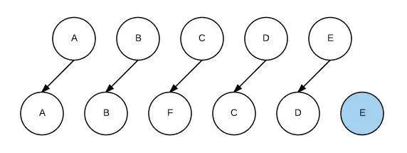

## VUE中演示v-for为什么要加key？  
无：key属性时，状态默认绑定的是位置。  
有：key属性时，状态根据key的属性值绑定到了相应的数组元素。 

---
  
首先讲一下diff算法的处理方法，对操作前后的dom树同一层的节点进行对比，一层一层对比，如下图：
  
当某一层有很多相同的节点时，也就是列表节点时，Diff算法的更新过程默认情况下也是遵循以上原则。  
比如一下这个情况：  
   
我们希望可以在B和C之间加一个F，Diff算法默认执行起来是这样的： 
  
即把C更新成F，D更新成C，E更新成D，最后再插入E，是不是很没有效率？  

**有key(调整位置过程)**  
所以我们需要使用key来给每个节点做一个唯一标识，Diff算法就可以正确的识别此节点，找到正确的位置区插入新的节点。

我们可以对同一层级的同组节点添加一个唯一的key进行区分，此处的key就好比数据库里面主键的概念，通过它可以唯一的确定一组节点。  
  
vue中列表循环需加:key="唯一标识" 唯一标识可以是item里面id index等，因为vue组件高度复用增加Key可以标识组件的唯一性，为了更好地区别各个组件 key的作用主要是为了高效的更新虚拟DOM

## vue中computed、watch和methods区别
- computed是计算属性，也就是依赖其它的属性计算所得出最后的值。只有在它的相关依赖发生改变时才会重新求值。computed主要用于对同步数据的处理。
- watch是去监听一个值的变化，然后执行相对应的函数。主要用于当你有一些数据需要随着其它数据变动而变动时。（搜索框）
- methods：可以定义方法来进行属性的修改,或者返回。他必须有一定的触发条件才能执行。

能使用watch属性的场景基本上都可以使用computed属性，而且computed属性开销小，性能高，因此能使用computed就尽量使用computed属性

## 父子组件如何通信  
### 通过prop实现父组件向子组件通信
- 在父组件定义要传给子组件的信息
- 在子组件用props接收父组件传过来的信息
```js
// 父组件
<template>
    <div>
    <h1>我是父组件！</h1>
    <child message="我是父组件传给子组件的信息"></child>
    </div>
</template>
<script>
import Child from '../components/child.vue'
export default {
    components:{
        child
    }
}

//子组件
<template>
    <div>{{message}}</div>
</template>
<script>
export default {
    props:['message']
}
</script>
```
### 通过$ref实现父组件向子组件通信  

### 通过$emit实现子组件向父组件通信
- 父组件通过@event监听和接收参数
- 在子组件用$emit绑定一个自定义事件event，当这个这个语句被执行到的时候，就会将参数arg传递给父组件
```js
//父组件
<template>
    <h1>这里是父组件</h1>
    <child @getMessage="showMsg"></child>
</template>
<script>
import Child from '../components/child.vue'
export default {
    components:{child},
    data(){
        return{
            msg:''
        }
    },
    methods:{
        showMsg(msg){
            this.msg = msg
        }
    }
}
</script>
//子组件
<template>
    <h1>这里子组件</h1>
</template>
<script>
import Child from '../components/child.vue'
export default {
    mouted:function(){
        this.$emit('getMessage','你好，这是子组件传给你的信息')
    }
}
</script>

```

## 对于MVC和MVVM的理解
### MVC  
- Mode（模型）：处理应用程序数据的逻辑。
- View（视图）：处理应用程序数据的展示。
- Controller（控制器）：处理用户交互。通常负责从视图中获取数据，控制用户输入，并向模型发送数据。


如图，中间有一个白线和黄线连起来的一个Y。根据这个Y我们要记住一些规则：  
C可以直接引用M和V，但事实M不能引用C，V也不能引用C，M和V之间也不能互相引用  
**View和Controller的交互**   
View上面有一个Action，指向Contoller（target），代表View会将事件传递给Controller。例如一个点击事件，View接受了点击事件，然后传递给Controller去处理，这种C和V的交互方式称为target-action。  
**Model和Controller的交互**  
M可以理解为数据的管理者，它可能会读取数据库里的数据，也可能向数据库存放数据。C负责把M最新的数据赋值给View  
**MVVM**：Model-View-ViewModel  
- Model:代表数据模型，关注数据本身，也可以在Model中定义数据修改和操作的业务逻辑。
- View:代表用户操作页面，负责把数据渲染出来
- ViewModel：对M进行数据解析，是一个同步Model和View的对象。

在MVVM架构下，View 和 Model 之间并没有直接的联系，而是通过ViewModel进行交互，Model 和 ViewModel 之间的交互是双向的， 因此View 数据的变化会同步到Model中，而Model 数据的变化也会立即反应到View 上。

ViewModel 通过双向数据绑定把 View 层和 Model 层连接了起来，而View 和 Model 之间的同步工作完全是自动的，无需人为干涉，因此开发者只需关注业务逻辑，不需要手动操作DOM, 不需要关注数据状态的同步问题，复杂的数据状态维护完全由 MVVM 来统一管理。

## vue的双向数据绑定原理是什么？
🤕通过数据劫持和发布订阅？？  
首先，Vue通过Object.defineProperty方法属性拦截的方法，把data对象里每个数据的读写转化成getter和setter，当数据变化时，通知数据更新。  
数据更新是基于发布订阅模式实现的。在这个模式下，数据是发布者(Observer),依赖对象是订阅者(watcher),他们需要一个中间人来传递，那就是订阅器(Dep)


## Vue-router的两种模式
Vue-router是Vue官方的路由管理器，用于构建单页面应用，在改变视图的同时不会像后端发送请求。  
vue-router默认hash模式,另一种是history模式。  
**Hash**  
Hash模式的原理是onhashchange事件，每次 hash 值的变化，会触发hashchange 这个事件。  
比如这个 URL：http://www.abc.com/#/hello，hash 的值为 #/hello。  
它的特点在于：hash 虽然出现在 URL 中，但不会被包括在 HTTP 请求中，对后端完全没有影响，因此改变 hash 不会重新加载页面。  
- hashHistory.push()：将新路由添加到浏览器历史访问的栈顶。当我们点击浏览器的返回按钮时可以看到之前的页面。  
- hashHistory.replace()：替换掉当前栈顶的路由。后退’按钮不能查看之前的页面。

**Histroy**
- pushState()：用于在浏览历史中添加历史记录
- replaceState()：修改浏览历史中当前纪录  
这两个方法应用于浏览器的历史记录栈，在当前已有的 back、forward、go 的基础之上，它们提供了对历史记录进行修改的功能。只是当它们执行修改时，虽然改变了当前的 URL，但浏览器不会立即向后端发送请求。

**区别**  
hash模式只能修改#后面的url片段，而history模式可以设置一个与当前URL同源的新的URL

<!-- ## Computed为什么有计算属性

## 再理解一次Vue生命周期(背的很熟？)


## 整理一下JS和ES6

## async和await??

## git 绑定远程分支

## vuex怎么获取数据 -->

## 路由跳转怎么传参？ 
- 直接放在path上:页面刷新数据不会丢失
```js
this.$router.push({path:'/nextUrl/${id}'})
//路由配置
{
    path:'/nextUrl:id/',
    name:'nextUrl',
    component:'nextUrl'
}
```
- params:参数是对象的时候，通过name来确定匹配的路由。params不会在url上面出现
```js
this.$router.push({name:'/nextUrl/',params:{id:id}})
this.$route.params.id//获取参数
```
- query:参数是字符串的时候，通过path来确定匹配的路由。query传递的参数会显示在url后面?id=？
```js
this.$router.push({path:'/nextUrl/',query:{id:id}})
this.$route.query.id//获取参数
```
params的路径中是不显示参数的 反而query是把参数拼接到路由的后面!  
展示上params路由传参像Ajax中post传参方式,query路由传参像get传参

<!-- ## props $emit $ref

## router-link和router.push区别 -->

## vue在什么时候可以获取Dom节点，怎么获取
- 借助ref属性
```js
<div ref="banana">better</div>
//获取
console.log(this.$refs.banana)
```

<!-- ## 再看一下大学做的系统 -->

## 什么情况下用v-if  
如果涉及到权限、安全、页面展示的情况下用v-if

## 父组件给子组件传值的生命周期是怎样的？
父组件created→父组件beforeMounted→子组件created→子组件beforeMounted→子组件mounted→父组件mounted;

<!-- ## 你有什么爱好：周末和同学出去拍照————哦吼！送了一条命！ -->

## oh精神小伙再接再厉哦！

热爱生活 永远热泪盈眶