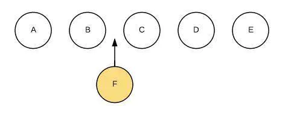
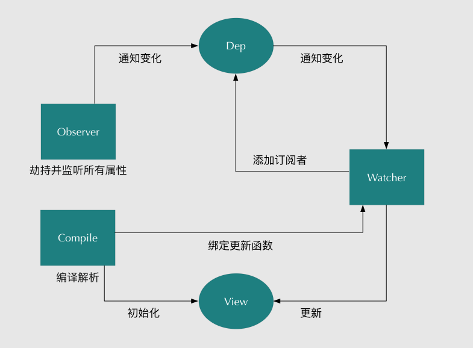

## :white_medium_square: 1. Vue 的生命周期

## :white_medium_square: 2. Vue 有哪些指令

## :white_medium_square: 3. Vue 有哪些内置组件

## :white_medium_square: 4. Vue 有哪些组件通信的方法

## :white_medium_square: 5. Vue 父子组件生命周期的调用顺序

## 为什么避免 v-if 和 v-for 用在一起

因为 `v-for` 的优先级高于 `v-if`  
来看下面这个 🌰

```js
<ul>
    <li v-for="user in userList"
        v-if="user.isActive"
        :key = "user.id"
    >
    {{ user.name }}
    </li>
</ul>
```

在上面这个 🌰 中，本来我们只要需要渲染出一部分的值（v-if 为 true 的值），但因为 `v-for` 比 `v-if` 具有更高的优先级，所以每次重新渲染的时候都会遍历整个列表的每个值，这不是我们想要的，那有什么解决办法呢？

🧠 解决办法

- 🍖 把 `v-if` 写在容器元素

```js
<ul v-if="user.isActive">
    <li v-for="user in userList"
        :key = "user.id"
    >
    {{ user.name }}
    </li>
</ul>
```

- 🍖 将列表通过计算属性再输出

```js
computed:{
    activeUser:function(){
        return this.userList.filter(function(user){
            return user.isActive
        })
    }
}
<ul>
    <li v-for="user in activeUser"
        :key = "user.id"
    >
    {{ user.name }}
    </li>
</ul>
```

## vue 如何响应路由参数的变化

🌰 ：当使用路由参数时，例如从 /lhz?id=1 到 lhz?id=2，此时原来的组件实例会被复用。这也意味着组件的生命周期钩子不会再被调用，此时 vue 应该如何响应路由参数的变化？

- 🍉 利用 `watch` 监听变化

```js
const User = {
  template: "...",
  watch: {
    $route(to, from) {
      // 对路由变化作出响应...
    },
  },
};
```

- 🍉 利用路由守卫

```js
const User = {
  template: "...",
  beforeRouteUpdate(to, from, next) {
    // react to route changes...
    // don't forget to call next()
  },
};
```

## 什么是编程式导航

除了使用 `<router-link>` 创建 a 标签来定义导航链接,我们还可以借助 router 的实例方法，通过编写代码来实现。

- 🍦 router.push: 这个方法会向 history 栈添加一个新的记录，所以，当用户点击浏览器后退按钮时，则回到之前的 URL。点击 `<router-link :to="...">` 等同于调用 router.push(...)。

```js
// 字符串
router.push("home");
// 对象
router.push({ path: "home" });
// 命名的路由
router.push({ name: "user", params: { userId: "123" } });
// 带查询参数，变成 /register?plan=private
router.push({ path: "register", query: { plan: "private" } });
```

注意：如果提供了 path，params 会被忽略

- 🍦 router.go(n): 这个方法的参数是一个整数，意思是在 history 记录中向前或者后退多少步

```js
// 在浏览器记录中前进一步，等同于 history.forward()
router.go(1);
// 后退一步记录，等同于 history.back()
router.go(-1);
// 前进 3 步记录
router.go(3);
// 如果 history 记录不够用，那就默默地失败呗
router.go(-100);
router.go(100);
```

- 🍦 router.replace
  跟 router.push 很像，唯一的不同就是，它不会向 history 添加新记录，而是跟它的方法名一样 —— 替换掉当前的 history 记录。

## 🎠 什么是 SPA 页面，优缺点是什么？

**SPA**(single-page application)：单页面应用。简单理解就是一个项目只有一个 web 页面，然后通过路由机制实现 HTML 内容的变换。

- _优点_
  - 良好的用户交互体验，用户在不断访问应用页面时不会重新加载整个页面，从而避免了重新加载页面
  - 基于上一点，服务器的压力小，不用管展示逻辑和页面合成，吞吐能力会提高几倍
  - 有利于前后端分离，前端负责交互逻辑，后端负责数据处理
- _缺点_
  - 初次加载耗时过多：为实现单页面的应用功能和显示效果，需要在加载页面时将 JavaScript、CSS 统一加载，部分页面按需加载。  
    <font color="#425fe;">可以压缩 js、css 代码,按需加载，懒加载</font>
  - SEO 难度较大：因为单页面内容切换时页面是不刷新的，所以网页记录和内容很难被引擎抓取到。  
    <font color="#425fe;">用#!代替#h,因为谷歌会抓取带有#!的 URL</font>
  - 前进后退路由管理：不能使用浏览器的前进后退功能。  
    <font color="#425fe;">配置路由，记录浏览记录的历史路由信息</font>

## 🎠VUE 中演示 v-for 为什么要加 key？

无：key 属性时，状态默认绑定的是位置。  
有：key 属性时，状态根据 key 的属性值绑定到了相应的数组元素。

---

  
首先讲一下 diff 算法的处理方法，对操作前后的 dom 树同一层的节点进行对比，一层一层对比，如下图：
  
当某一层有很多相同的节点时，也就是列表节点时，Diff 算法的更新过程默认情况下也是遵循以上原则。  
比如一下这个情况：  
  
我们希望可以在 B 和 C 之间加一个 F，Diff 算法默认执行起来是这样的：
  
即把 C 更新成 F，D 更新成 C，E 更新成 D，最后再插入 E，是不是很没有效率？

**有 key(调整位置过程)**  
所以我们需要使用 key 来给每个节点做一个唯一标识，Diff 算法就可以正确的识别此节点，找到正确的位置区插入新的节点。

我们可以对同一层级的同组节点添加一个唯一的 key 进行区分，此处的 key 就好比数据库里面主键的概念，通过它可以唯一的确定一组节点。  
  
vue 中列表循环需加:key="唯一标识" 唯一标识可以是 item 里面 id index 等，因为 vue 组件高度复用增加 Key 可以标识组件的唯一性，为了更好地区别各个组件 key 的作用主要是为了高效的更新虚拟 DOM

## 🎠vue 中 computed、watch 和 methods 区别

- computed 是计算属性，也就是依赖其它的属性计算所得出最后的值。只有在它的相关依赖发生改变时才会重新求值。computed 主要用于对同步数据的处理。
- watch 是去「观察」一个值的变化，然后执行相对应的函数。watch 监听的响应式数据必须在 data 中初始化。类似于某些数据的监听回调，每当监听的数据变化时都会执行回调进行后续操作。主要用于当你有一些数据需要随着其它数据变动而变动时。（搜索框）
- methods：可以定义方法来进行属性的修改,或者返回。他必须有一定的触发条件才能执行。

**区别**:

- computed 是一个属性，methods 是一个函数，可以传递参数
- computed 具有响应式依赖缓存的特性，只有依赖发生改变，才会执行。
- watch 可以编写异步操作，computed 不可以

能使用 watch 属性的场景基本上都可以使用 computed 属性，而且 computed 属性开销小，性能高，因此能使用 computed 就尽量使用 computed 属性

#### 运用场景

- 当我们需要进行数值计算，并且依赖于其他数据时，应该使用 computed,因为可以利用 computed 的缓存特性，避免每次获取值时，都要重新计算。
- 当我们需要在数据变化时执行异步操作或者其他开销比较大的操作时，选择 watch,他允许为我们在执行一个异步操作时，限制我们执行该操作的频率，并在我们得到最终结果前，设置中间状态。

## 🎠 组件之间如何通信

#### 通过 prop 实现父组件向子组件通信

- 在父组件定义要传给子组件的信息
- 在子组件用 props 接收父组件传过来的信息

```js
// 父组件
<template>
    <div>
    <h1>我是父组件！</h1>
    <child message="我是父组件传给子组件的信息"></child>
    </div>
</template>
<script>
import Child from '../components/child.vue'
export default {
    components:{
        child
    }
}

//子组件
<template>
    <div>{{message}}</div>
</template>
<script>
export default {
    props:['message']
}
</script>
```

#### 通过$children和$parent、$ref 实现组件通信

- $parent/$children：访问父/子实例。  
  🍗 父组件只有一个，是唯一确定的

```js
// children.vue
<script>
export default{
    created(){
        console.log(this.$parent.name)
    }
}
</script>
```

🍗 但是子组件可以有多个，所以$children 返回的数组

```js
<script>
export default{
    created(){
        console.log(this.$children)
        this.$children.forEach((VueComponent)=>{
            if(VueComponent.name == "你要找的组件名"){
                // 执行操作
            }
        })
    }
}
</script>
```

- $ref: 如果是在普通的 DOM 元素上使用，引用的指向就是该 DOM 元素。如果是在子组件上，引用的就是子组件的实例

```js
// father.vue
<template>
    <div>
        <Children ref="child1"></Children>
    </div>
</tempate>
<script>
import Children from '/children.vue
export default{
    data() {
        return{
           name =  'fatherbanana'
        }
    },
    mounted(){
        console.log(this.$ref.child1.name)//fatherbanana123
    }
}
</script>
// children.vue
<script>
export default {
    data(){
        return {
            name: 'childrenbanana'
        }
    },
    mounted(){
        this.name = this.$parent.name + '123';
    }
};
```

#### 通过$emit 实现子组件向父组件通信

- 父组件通过@event 监听和接收参数
- 在子组件用$emit 绑定一个自定义事件 event，当这个这个语句被执行到的时候，就会将参数 arg 传递给父组件

```js
//父组件
<template>
    <h1>这里是父组件</h1>
    <child @getMessage="showMsg"></child>
</template>
<script>
import Child from '../components/child.vue'
export default {
    components:{child},
    data(){
        return{
            msg:''
        }
    },
    methods:{
        showMsg(msg){
            this.msg = msg
        }
    }
}
</script>
//子组件
<template>
    <h1>这里子组件</h1>
</template>
<script>
import Child from '../components/child.vue'
export default {
    mouted:function(){
        this.$emit('getMessage','你好，这是子组件传给你的信息')
    }
}
</script>

```

#### eventBus:父子、兄弟、隔代组件

创建一个空的 vue 实例

#### $root

#### provide 和 inject：隔代

<!-- https://juejin.cn/post/6844904048118726663#comment -->

## 🎠Vue 的父组件和子组件生命周期钩子函数执行顺序？

可以分为四个部分：

- **加载渲染阶段**：  
  **父** _beforeCreate_ ➡ **父** _created_ ➡ **父** _beforeMounted_ ➡ **子** _beforeCreate_ ➡ **子** _created_ ➡ **子** _beforeMounted_ ➡ **子** _mounted_ ➡ **父** _mounted_
- **子组件更新过程**：  
  **父** _beforeUpdate_ ➡ **子** _beforeUpdate_ ➡ **子** _updated_ ➡ **父** _updated_
- **父组件更新过程**：  
  **父** _beforeUpdate_ ➡ **父** _updated_
- **销毁阶段**：  
  **父** _beforeDestroy_ ➡ **子** _beforeDestroy_ ➡ **子** _destroyed_ ➡ **父** _destroyed_

## 🎠 对于 MVC 和 MVVM 的理解

#### MVC

- Mode（模型）：处理应用程序数据的逻辑。
- View（视图）：处理应用程序数据的展示。
- Controller（控制器）：处理用户交互。通常负责从视图中获取数据，控制用户输入，并向模型发送数据。
  

如图，中间有一个白线和黄线连起来的一个 Y。根据这个 Y 我们要记住一些规则：  
C 可以直接引用 M 和 V，但事实 M 不能引用 C，V 也不能引用 C，M 和 V 之间也不能互相引用  
**View 和 Controller 的交互**  
View 上面有一个 Action，指向 Contoller（target），代表 View 会将事件传递给 Controller。例如一个点击事件，View 接受了点击事件，然后传递给 Controller 去处理，这种 C 和 V 的交互方式称为 target-action。  
**Model 和 Controller 的交互**  
M 可以理解为数据的管理者，它可能会读取数据库里的数据，也可能向数据库存放数据。C 负责把 M 最新的数据赋值给 View  
**MVVM**：Model-View-ViewModel

- Model:代表数据模型，关注数据本身，也可以在 Model 中定义数据修改和操作的业务逻辑。
- View:代表用户操作页面，负责把数据渲染出来
- ViewModel：对 M 进行数据解析，是一个同步 Model 和 View 的对象。

在 MVVM 架构下，View 和 Model 之间并没有直接的联系，而是通过 ViewModel 进行交互，Model 和 ViewModel 之间的交互是双向的， 因此 View 数据的变化会同步到 Model 中，而 Model 数据的变化也会立即反应到 View 上。

ViewModel 通过双向数据绑定把 View 层和 Model 层连接了起来，而 View 和 Model 之间的同步工作完全是自动的，无需人为干涉，因此开发者只需关注业务逻辑，不需要手动操作 DOM, 不需要关注数据状态的同步问题，复杂的数据状态维护完全由 MVVM 来统一管理。

## 🎠vue 的双向数据绑定是怎么实现的？

#### 什么是双向绑定？

Vue 是 MVVM 的模式，在 MVVM 框架下，通过 ViewModel，View 数据的变化会同步到 Model,而 model 数据的变化也会立即反应到 View 上。也就是说，不需要手动操作 DOM 就实现了内容的实时更新。

- 输入框内容变化时，Data 中的数据同步变化。即 View=>Data
- Data 中的数据变化，文本节点的内容同步变化。即 Data=>View

#### 双向绑定的原理是什么？

首先看看这张图
  
图中有几个需要了解的东西

- Observer: **数据监听器**,能够对数据的所有属性进行监听，利用 Object.defineProperty()对属性都加上 setter 和 getter。当给一个属性赋值时，就会触发 setter，那么就能监听到数据的变化了。
- Dep：**消息订阅器**，内部有一个收集订阅者(Watcher)的数组，对监听器和订阅者统一管理
- Watcher：**订阅者**，连接 Observer 和 Compile 的桥梁，主要任务是订阅 Observer 中的属性值变化的消息，当收到属性值变化的消息，触发解析器的更新函数。
- Compile：**指令解析器**，对每个元素节点的指令进行扫描和解析，根据指令模板替换数据，以及绑定相应的更新数据。

首先，Vue 通过 Object.defineProperty 方法属性拦截的方法，把 data 对象里每个数据的读写转化成 getter 和 setter，当数据变化时，通知数据更新。  
数据更新是基于发布-订阅模式实现的。在这个模式下，数据是发布者(Observer),依赖对象是订阅者(watcher),他们需要一个中间人来传递，那就是订阅器(Dep)。  
**总结**：vue 通过数据监听器拦截数据变化，这个数据监听是通过 Object.defindeProperty 方法，他可以把属性的读写转化成 getter 和 setter，当一个属性被赋值的时候，就会触发 setter 函数，从而实现数据的监听。当监听到数据变化之后，会通过一个订阅器通知订阅者某个属性值发生变化，而这个订阅者会结合一个可以对元素指令进行扫描和解析的指令解析器去更新最新的数据。

## 🎠Vue-router 的两种模式

Vue-router 是 Vue 官方的路由管理器，用于构建单页面应用，在改变视图的同时不会像后端发送请求。  
vue-router 默认 hash 模式,另一种是 history 模式。  
**Hash**  
Hash 模式的原理是 onhashchange 事件，每次 hash 值的变化，会触发 hashchange 这个事件。  
比如这个 URL：http://www.abc.com/#/hello，hash 的值为 #/hello。  
它的特点在于：hash 虽然出现在 URL 中，但不会被包括在 HTTP 请求中，对后端完全没有影响，因此改变 hash 不会重新加载页面。

- hashHistory.push()：将新路由添加到浏览器历史访问的栈顶。当我们点击浏览器的返回按钮时可以看到之前的页面。
- hashHistory.replace()：替换掉当前栈顶的路由。后退’按钮不能查看之前的页面。

**Histroy**

- pushState()：用于在浏览历史中添加历史记录
- replaceState()：修改浏览历史中当前纪录  
  这两个方法应用于浏览器的历史记录栈，在当前已有的 back、forward、go 的基础之上，它们提供了对历史记录进行修改的功能。只是当它们执行修改时，虽然改变了当前的 URL，但浏览器不会立即向后端发送请求。

**区别**  
hash 模式只能修改#后面的 url 片段，而 history 模式可以设置一个与当前 URL 同源的新的 URL

<!--
## 再理解一次Vue生命周期(背的很熟？)

## 整理一下JS和ES6

## async和await??

## git 绑定远程分支

## vuex怎么获取数据 -->

## 🎠 路由跳转怎么传参？

- 直接拼接在 path 上:页面刷新数据<font color="#f34134">不会丢失</font>

```js
this.$router.push({path:'/nextUrl/${id}'})
//路由配置
{
    path:'/nextUrl:id/',
    name:'nextUrl',
    component:'nextUrl'
}
// 获取参数方法
this.$route.params.id
```

- params:参数是对象的时候，通过 name 来确定匹配的路由。params 不会在 url 上面出现。页面刷新数据<font color="#f34134">会丢失</font>

```js
this.$router.push({ name: "/nextUrl/", params: { id: id } });
this.$route.params.id; //获取参数
```

- query:参数是字符串的时候，通过 path 来确定匹配的路由。query 传递的参数会显示在 url 后面?id=？,页面刷新数据<font color="#f34134">不会丢失</font>

```js
this.$router.push({ path: "/nextUrl/", query: { id: id } });
this.$route.query.id; //获取参数
```

params 的路径中是不显示参数的 反而 query 是把参数拼接到路由的后面!  
展示上 params 路由传参像 Ajax 中 post 传参方式,query 路由传参像 get 传参

## 🎠vue 在什么时候可以获取 Dom 节点，怎么获取

在 Mounted 钩子函数可以访问操作 DOM

- 利用原生 JS 如 `document.getElementById`
- 借助 ref 属性

```js
<div ref="banana">better</div>;
//获取
console.log(this.$refs.banana);
```

## 🎠V-show 和 v-if 有什么区别？

**v-if** ：是条件渲染，是对 DOM 节点的重建和销毁。它是惰性的：如果初始渲染条件为假，则什么都不做；直到条件为真时才会渲染条件块。  
**v-show**: 是 css 的 display 属性的切换,`display:none;`(会影响布局)。

如果是频繁切换的话一般使用 v-show;如果涉及到权限、安全、页面展示的情况下用 v-if。

## 🎠v-if 和 v-show 在执行的时候参与了哪些生命周期？

- **v-if**：
  - **初始渲染**：初始值为 false 组件不会渲染，生命周期钩子不会执行。初始值为 true 时，组件会进行渲染，并依次执行 beforeCreate,created,beforeMount,mounted 钩子。
  - **false=>true**：_beforeCreate_ ➡ _Created_ ➡ _beforeMounted_ ➡ _mounted_
  - **true=>false**: _beforeDestroy_ ➡ _Destroyed_
- **v-show**：
  - **初始渲染**：无论初始状态，都会渲染，并依次执行 _beforeCreate_ ➡ _Created_ ➡ _beforeMounted_ ➡ _mounted_
  - **切换**：对生命周期无影响,切换时组件始终保持在 mounted 钩子

## 🎠vue 如何操作数组

因为 JavaScript 的限制，Vue 不能检测到数组的变化，所以不能通过操作数组来渲染 dom 的，不能通过属性或者索引控制数组，比如 length，index，解决的方法是通过 set 方法

- 根据索引值赋值

```js
Vue.set(vm.items, indexOfItem, newValue);
// vm.$set，Vue.set的一个别名
vm.$set(vm.items, indexOfItem, newValue);
// Array.prototype.splice
vm.items.splice(indexOfItem, 1, newValue);
```

- 修改数组长度

```js
// Array.prototype.splice
vm.items.splice(newLength);
```

## 🎠 什么是 keep-alive？

**keep-alive** 是 Vue 提供的一个抽象组件，用于缓存组件，保留组件状态或避免重新渲染。

- 当 `keep-alive` 被激活时会触发 `actived`钩子函数，被移除时触发 `deactivated` 钩子函数
- 它有两个属性，都支持字符串和正则表达式
  - `incude` ：表示匹配的组件会被缓存
  - `exclude` ：表示匹配的组件不会被缓存「优先级比 include 高」

## 🎠this.$route和this.$router 的区别？

两者都是一个对象，都和路由有关，那他们有什么区别呢？

- **$router** ：是 VueRouter 的实例,相当于一个全局的路由器对象。
  - $router.push
  - $router.go
  - $router.back
  - $router.replace
- **route** : 当前路由对象。
  - $route.query
  - $route.params
  - $route.path
  - $route.hash

## 🎠router-link 和 router.push 区别

- router-link 可以实现页面的跳转，会在渲染的时候就加载对应的路由，会默认阻止浏览器的默认
- router.push 也可以实现页面的跳转，还可以在跳转前写一些逻辑。

<!-- ## 你有什么爱好：周末和同学出去拍照————哦吼！送了一条命！ -->

## 🎠 说一说 Vue SSR

简单的理解就是：vue 在客户端将标签渲染成整个 html 片段的工作，在服务器完成，服务器形成 html 片段直接返回给客户端这个过程就叫做 SSR(服务端渲染)。[官网教程](https://ssr.vuejs.org/zh/guide/)

- 优点
  - 首屏加载更快
  - 更好的 SEO
- 缺点
  - 开发限制：服务器端渲染只只支持 `beforeCreate` 和 `created`
  - 更多的服务器负载：因为在 Node.js 渲染完整的应用程序需要占用大量的 CPU 资源

## 🎠class 和 style 绑定

**class 的绑定**:

- `:class="{样式名:响应式数据...}"`

```js
<div class="static" v-bind:class="{active:isActive,'text-danger':hasError}">
data:{
    isActive: true,
    hasError:false
}
//结果渲染为：class="static active"
```

- `:class="[响应式数据1，...]"`

```js
<div v-bind:class="[activeClass,errorClass]"></div>
data:{
    activeClass:'active',
    errorClass:'text-danger'
}
//class="active text-danger"
```

style 的绑定与 class 类似

## 🎠slot 插槽是什么？

定义：是 vue 中可以实现在组件内额外添加其他拓展内容的属性。

- 具名插槽：规定在指定位置出现什么内容
- 作用域插槽：主要作用是在书写插槽内容时可以获取到插槽作用域的值

```js
//子组件
<template>
<div>hi
<slot :data="banana"></slot>
</div>
</template>
<script>
export default {
    name: 'slotbanana',
    data(){
        return{
            user:[
                {name:"ba",age:18},
                {name:"na",age:20},
                {name:"na",age:22}
            ]
        }
    }
}
</script>
//父组件
<template>
<div>
<slotbanana>
<template slot-scope="user">
<div v-for="item in user.data" :key="item.id">{{item}}</div>
</template>
</slotbanana>
</div>
</template>
```

## 🎠vue-router 导航守卫

**官方**：通过跳转和取消的方式守卫导航。一共有:seven:个钩子函数。  
**应用**：用户访问页面前提醒用户登录，用户离开页面前提醒用户

- **全局钩子**：
  - `router.beforeEach`：全局前置守卫
  - `router.beforeResolve`：全局解析守卫
  - `router.afterEach`：全局后置守卫
- **组件钩子**
  - `beforeRouteEnter`
  - `beforeRouteUpdate`
  - `beforeRouteLeave`
  ```js
   beforeRouteEnter(to,from,next){
       //在渲染该组件的对应路由被comfirm前调用
       //不能获取组件实例'this',因为当守卫执行前，组件实例还没被创建
   }
   beforeRouteUpdate(to,from,next){
       //在当前路由发生改变时调用
       // 举例来说，对于一个带有动态参数的路径 /foo/:id，在 /foo/1 和 /foo/2 之间跳转的时候，
       // 由于会渲染同样的 Foo 组件，因此组件实例会被复用。而这个钩子就会在这个情况下被调用。
       //可以获取组件实例'this'
   }
   beforeRouteLeave(to,from,next){
       //导航离开该组件的对应路由时调用
       //可以获取组件实例'this'
   }
  ```
- **路由钩子**
  - `beforeEnter`：路由管道钩子

这几个钩子都接受三个参数：

- `to`：即将要<font color="#f34134">进入</font>的目标路由对象，该对象有目标页的路由信息
- `from`：当前导航要<font color="#f34134">离开</font>的路由，该对象有当前页的路由信息
- `next`: 是一个 `Function`，一定要用这个方法来 resolve 这个钩子。执行效果依赖 next 方法的调用参数
  - `next()`：进入<font color="#f34134">下一个钩子</font>，如果全部钩子执行完了，则导航的状态就是`comfirmd`(确认的)
  - `next('/')`或者`next({path:'/'})`：跳转到<font color="#f34134">新导航</font>,可像 router-link 或 router.push 设置参数
  - `next(false)`：中断导航，如果浏览器的 URL 改变了（浏览器后退按钮），就会回到`from`路由对应的的地址
  - `next(error)`：导航终止且该错误会被传递给`router.onError()`注册过的回调

**完成的导航解析过程**

- 导航被触发
- 失活导航调用 beforeRouteLeave
- 调用全局钩子 beforeEach
- 失活导航调用 beforeRouteUpdate
- 调用路由钩子 beforeEnter
- 解析异步路由组件
- 激活导航调用 beforeRouteEnter
- 调用全局钩子 beforeResolve
- 导航被确认
- 调用全局钩子 afterEach
- 触发 DOM 更新
- 用创建好的实例调用 beforeRouteEnter 守卫中传给 next 的回调函数
  

**应用场景解析**：页面跳转前需验证是否登录，若为已登录，则可跳转；若未登录或者登录过期，则跳到登录页面。

```js
//将表示登录状态的变量存放到store对象中
export default new Vuex.Store({
    states:{
        isLogin:false;
    },
    mutations:{
        handleLogin(state,login){
            state.isLogin = login;//把最新的登录状态更新到Store中
        }
    }
})
//登录页，输入账户密码登录成功之后，改变登录状态为true
methods:{
    ...mapMutations(['handleLogin']),
    summitLogin(){
        this.handleLogin(true)//改变状态
        this.$route.push({path:'/home'})//跳到主页
    }
}
//每一次页面切换时，全局钩子beforeEach都会触发，去验证用户的登录状态
router.beforeEach((to,from,next)=>{
    const isLogin = obj.state.isLogin;
    //判断是不是要跳到登录页面或者目前是否为登录状态
    if(to.path === './login' || isLogin){
        next();
    }else{
        next('/login');//非登录状态，跳到登录页面
    }
})
```

## 🎠 关于虚拟 DOM

**Virtul DOM** 就是对 Dom 的抽象，本质上是一个 Javascript 对象。

**为什么要有这个东西呢**  
前端优化有一个点就是尽可能地减少手动操作 DOM，因为频繁的变动 DOM 会造成浏览器的重构和回流，这些都会降低性能。而且前端框架都是以不操作 DOM 为基本要求，所以需要引入 Virtual DOM 这个东西，让原本的 DOM 操作让 JS 来完成，而不去麻烦浏览器。

**Virtual DOM** 的 **diff** 算法是 **Virtul DOM** 的核心，它通过比较新旧的 **Virtul DOM Tree** 来找出差异并更新

## 🎠 双向数据绑定有什么缺点？

**Object.defineProperty 不能监听数组下标的变化**

```js
app.myArr[index] = newVal; //不能实现
//push()//pop()//shift()//unshift()//splice()//sort()//reverse()//不能
Vue.set(app.myArr, index, newVal); //可以实现
```

**vue 实例创建后，再向其上添加属性，不能监听**  
解决办法：使用`Vue.set`设置一个新的对象属性。该方法确保将属性创建为一个响应式属性，并触发视图更新：

## 🎠 如何进行错误捕获

JavaScript 中，Error 是一个构造函数，通过它创建一个错误对象。当运行时错误产生时，Error 的实例对象会被抛出。构造一个 Error 的语法如下：

```js
// message: 错误描述
// fileName: 可选。被创建的Error对象的fileName属性值。默认是调用Error构造器代码所在的文件的名字。
// lineNumber: 可选。被创建的Error对象的lineNumber属性值。默认是调用Error构造器代码所在的文件的行号。
new Error([message[, fileName[, lineNumber]]])
```

**try...catch...**：局部监听异常

```js
try {
  var a = 1;
  var b = a + c;
} catch (e) {
  // 捕获处理
  console.log(e); // ReferenceError: c is not defined
}
```

**window.onerror 与 window.addEventListener('error')**：用于全局监听异常，捕获 js 运行时错误

```js
window.onerror = function(message, source, lineno, colno, error) { ... }
```

_跨域之后 window.onerror 是无法捕获异常信息的_

```js
//解决方案便是script属性配置 crossorigin="anonymous" 并且服务器添加Access-Control-Allow-Origin。
<script src="http://cdn.xxx.com/index.js" crossorigin="anonymous"></script>
```

MVVM 框架的捕获方法

```js
Vue.config.errorHandler = function (err, vm, info) {
  let {
    message, // 异常信息
    name, // 异常名称
    script, // 异常脚本url
    line, // 异常行号
    column, // 异常列号
    stack, // 异常堆栈信息
  } = err;
  // vm为抛出异常的 Vue 实例
  // info为 Vue 特定的错误信息，比如错误所在的生命周期钩子
};
```

<!-- https://juejin.im/post/5aaa93345188257bf550cbfd#heading-8 -->

## 如何实现一个类似于淘宝搜索框显示实时列表的功能

## 再加深一下 MVVM 和 MVC 的理解

热爱生活 永远热泪盈眶
